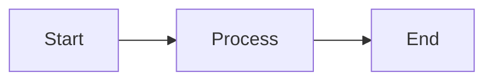

# Canvasdown

**A Mermaid-like DSL for React Flow, designed for AI agents.**

[](https://www.npmjs.com/package/@ssota-labs/canvasdown)
[](https://www.npmjs.com/package/@ssota-labs/canvasdown-reactflow)
[](https://opensource.org/licenses/MIT)
[](https://www.typescriptlang.org/)

```
DSL Text → Parser → Graph Data → Layout → Renderer (React Flow, etc.)
```

## Why Canvasdown?

### The Problem: AI Agents and Canvas Manipulation

When building **SSOTA**, a canvas-based research agent, we faced a fundamental challenge: **How do AI agents efficiently manipulate canvas elements?**

Traditional approaches require AI agents to make sequential tool calls—like a CPU executing instructions one by one:

```
1. add_block("node1", "Start")
2. add_block("node2", "Process")  
3. add_block("node3", "End")
4. connect_edge("node1", "node2")
5. connect_edge("node2", "node3")
...
```

This CPU-like approach has significant drawbacks:
- **Too many tool calls** — Each operation requires a separate API call
- **Verbose tool descriptions** — LLMs need extensive context for each tool
- **Sequential bottleneck** — Operations must be executed one after another
- **Error-prone** — More calls mean more chances for mistakes

### The Solution: GPU-like Batch Generation

We reimagined the approach: **What if AI could generate an entire canvas in one shot, like a GPU rendering a frame?**

Inspired by [Mermaid](https://mermaid.js.org/)'s human-readable diagram syntax, we created **Canvasdown**—an LLM-friendly, text-based DSL that allows AI agents (and humans) to define complete diagrams in a single generation:

```
canvas LR

@shape start "Start" { color: green }
@shape process "Process Data" { color: blue }
@shape end "End" { color: red }

start -> process : "begins"
process -> end : "completes"
```

One text block. One tool call. Entire canvas rendered.

### Why Not Just Use Mermaid?

| Feature | Mermaid | Canvasdown |
|---------|---------|------------|
| **Incremental Updates** | ❌ Must regenerate entire diagram | ✅ Patch DSL for incremental changes |
| Custom node types | ⚠️ Custom SVG shapes (complex) | ✅ Simple dynamic registration |
| **Custom React Components** | ❌ SVG shapes only | ✅ **Use your existing React components** |
| React Flow integration | ❌ Not officially supported | ✅ First-class adapter |
| Framework independence | ❌ Tied to Mermaid renderer | ✅ Core is renderer-agnostic |
| Runtime type registration | ⚠️ New diagram types only | ✅ Simple block/edge type registration |

**Key Advantages:**
1. **Incremental Updates**: Mermaid requires regenerating the entire diagram text for any change. Canvasdown's Patch DSL lets you update individual nodes/edges without touching the rest.
2. **Your Components Stay Yours**: Mermaid forces you to use SVG shapes. Canvasdown lets you use your existing React Flow node components, maintaining your design system and interactivity.
3. **AI Agent Friendly**: Patch DSL means AI agents can make iterative changes efficiently, unlike Mermaid's all-or-nothing approach.

## Features

### Core Features
- **Mermaid-style DSL** — Human-readable, AI-friendly text format
- **Dynamic Type System** — Register custom block/edge types at runtime
- **Framework Independent Core** — Pure TypeScript, no React dependency
- **React Flow Adapter** — First-class React Flow integration
- **Auto Layout** — dagre-based automatic positioning

### 🔥 What Sets Us Apart from Mermaid

| Capability | Mermaid | Canvasdown |
|------------|---------|------------|
| **Incremental Updates** | ❌ Must regenerate entire diagram text | ✅ Patch DSL (`@add`, `@update`, `@delete`) |
| **Custom React Components** | ❌ SVG shapes only (no React components) | ✅ Any React component |
| **React Flow Integration** | ❌ Not officially supported | ✅ First-class adapter |
| **Dynamic Properties** | ⚠️ Limited to predefined attributes | ✅ Custom properties per block type |
| **Edge Labels** | ✅ Basic edge labels | ✅ Edge labels + source/target labels + custom properties |
| **Runtime Type Registration** | ⚠️ New diagram types only (complex) | ✅ Simple block/edge type registration |

### Block Features
- **🔥 Use Your React Components** — Your existing React Flow node components work out-of-the-box
- **Dynamic Component Rendering** — Block properties are passed to your React components for dynamic rendering
- **Custom Properties** — Define custom properties independent of block types (`@schema`, inline properties)
- **Type Validation** — Optional runtime validation for block properties
- **Property Schema** — Define property constraints (enum values, types, ranges) for validation and LLM template generation

### Edge Features
- **Edge Properties** — Define custom data on edges
- **Edge Labels** — Label your connections with text
- **Source/Target Labels** — Add labels at edge start and end points
- **Edge Types** — Register custom edge types with different styles

### Patch DSL (Mermaid Can't Do This!)
Unlike Mermaid where you must regenerate the entire diagram text for any change, Canvasdown supports **incremental updates**:

**Mermaid approach** (regenerate everything):

*To add node D, you must rewrite the entire diagram text*

**Canvasdown approach** (incremental patches):
```
@add [shape:newNode] "New Node"    // Add without regenerating
@update existingNode { color: red } // Update single property
@delete oldNode                     // Remove specific node
@connect a -> b                     // Add single edge
```

This is crucial for AI agents that need to make iterative changes to a canvas without regenerating the entire diagram.

## Installation

```bash
# Core package (DSL parser and layout engine)
npm install @ssota-labs/canvasdown

# React Flow adapter
npm install @ssota-labs/canvasdown-reactflow

# Peer dependencies for React Flow adapter
npm install @xyflow/react react react-dom
```

## Quick Start

### 1. Register Block Types

```typescript
import { CanvasdownCore } from '@ssota-labs/canvasdown';

const core = new CanvasdownCore();

// Register block types with default properties and sizes
core.registerBlockType({
  name: 'shape',
  defaultProperties: { shapeType: 'rectangle', color: 'blue' },
  defaultSize: { width: 200, height: 100 },
  // Optional: Define property schema for validation and LLM template generation
  propertySchema: {
    shapeType: {
      type: 'enum',
      enum: ['rectangle', 'ellipse', 'triangle', 'diamond'],
      description: 'Shape type for the block',
    },
    color: {
      type: 'enum',
      enum: ['red', 'orange', 'green', 'blue', 'purple', 'pink', 'gray'],
    },
  },
});

core.registerBlockType({
  name: 'markdown',
  defaultProperties: { content: '', theme: 'light' },
  defaultSize: { width: 300, height: 150 },
});
```

### 2. Parse and Layout DSL

```typescript
const dsl = `
canvas LR

@shape start "Start" { shapeType: ellipse, color: green }
@text process "Process Data"
@shape end "End" { shapeType: ellipse, color: red }

start -> process : "begins"
process -> end : "completes"
`;

const result = core.parseAndLayout(dsl);
// result.nodes - positioned graph nodes
// result.edges - graph edges
```

### 3. Use with React Flow

```tsx
import { useCanvasdown } from '@ssota-labs/canvasdown-reactflow';
import { ReactFlow } from '@xyflow/react';
import { ShapeBlock } from './components/ShapeBlock';
import { MarkdownBlock } from './components/MarkdownBlock';

// Map block type names to your React components
const nodeTypes = {
  shape: ShapeBlock,
  markdown: MarkdownBlock,
};

function MyCanvas() {
  const { nodes, edges, error } = useCanvasdown(dsl, { core });

  if (error) return <div>Error: {error}</div>;

  return (
    <ReactFlow
      nodes={nodes}
      edges={edges}
      nodeTypes={nodeTypes}
    />
  );
}
```

### 4. Patch the Canvas

```typescript
import { useCanvasdownPatch } from '@ssota-labs/canvasdown-reactflow';

function MyCanvas() {
  const { nodes, edges, applyPatch } = useCanvasdownPatch(initialDsl, { core });
  
  // Incrementally update the canvas
  applyPatch(`
    @add [shape:newNode] "New Node" { color: purple }
    @connect process -> newNode
    @update end { color: orange }
    @delete oldNode
  `);
  
  return <ReactFlow nodes={nodes} edges={edges} />;
}
```

## DSL Syntax

### Canvas Declaration

```
canvas LR    // Left to Right
canvas TB    // Top to Bottom
canvas RL    // Right to Left
canvas BT    // Bottom to Top
```

### Block Definition

```
@blockType id "Label" {
  property1: value1
  property2: value2
}
```

### Edge Definition

```
source -> target                           // Basic connection
source -> target : "label"                 // With label
source -> target : edgeType                // With edge type
source -> target : edgeType {              // With edge type and properties
  property: value
}
source -> target : "label" {               // Label + properties
  sourceLabel: "from"                      // Label at source end
  targetLabel: "to"                        // Label at target end  
  animated: true
  style: { stroke: "#ff0000" }
}
```

### Patch Commands

```
@add [blockType:id] "Label" { ... } // Add new block
@update id { property: newValue }   // Update block properties
@delete id                          // Delete block
@connect source -> target           // Add edge
@disconnect source -> target        // Remove edge
@move id { x: 100, y: 200 }         // Move block
@resize id { width: 300, height: 200 }  // Resize block
```

## Packages

| Package | Description |
|---------|-------------|
| `@ssota-labs/canvasdown` | DSL parser, type registry, graph builder, dagre layout |
| `@ssota-labs/canvasdown-reactflow` | React Flow adapter, hooks, and components |

## Architecture

```
packages/
├── core/                   # @ssota-labs/canvasdown
│   ├── parser/             # Chevrotain-based DSL parser
│   ├── registry/           # Block/Edge type registration
│   ├── builder/            # AST → Graph Data conversion
│   └── layout/             # dagre layout engine
│
├── adapter/
│   └── react-flow/         # @ssota-labs/canvasdown-reactflow
│       ├── adapter/        # Core output → React Flow conversion
│       ├── hooks/          # useCanvasdown, useCanvasdownPatch
│       └── components/     # CustomEdge, etc.
│
└── examples/               # Example application
```

## Use Cases

### AI Agent Canvas Manipulation

```typescript
// AI generates DSL in one response
const aiGeneratedDsl = await llm.generate(`
  Create a flowchart showing user authentication flow
`);

// Single tool call renders entire canvas
core.parseAndLayout(aiGeneratedDsl);
```

### Interactive Diagram Editing

```typescript
// Human-friendly editing
const dsl = `
canvas TB

@markdown intro "# Welcome" { theme: dark }
@image diagram "Architecture" { src: "/arch.png" }
@youtube video "Demo" { videoId: "abc123" }

intro -> diagram -> video
`;
```

### Real-time Collaboration

```typescript
// Patch-based updates for collaborative editing
socket.on('patch', (patchDsl) => {
  applyPatch(patchDsl);
});
```

### Use Your Existing Design System

```tsx
// Your existing components work seamlessly
import { KanbanCard } from './components/KanbanCard';
import { DatabaseTable } from './components/DatabaseTable';
import { ApiEndpoint } from './components/ApiEndpoint';

const core = new CanvasdownCore();

core.registerBlockType({
  name: 'kanban-card',
  component: KanbanCard,    // ← Your KanbanCard component!
  defaultProperties: { status: 'todo', assignee: null },
  defaultSize: { width: 300, height: 200 },
  propertySchema: {
    status: {
      type: 'enum',
      enum: ['todo', 'in-progress', 'done'],
      description: 'Task status',
    },
  },
});

core.registerBlockType({
  name: 'db-table',
  component: DatabaseTable,  // ← Your DatabaseTable component!
  defaultProperties: { tableName: '', columns: [] },
  defaultSize: { width: 250, height: 300 },
});
```

### Property Schema for LLM Template Generation

Define property schemas to generate template prompts for LLMs:

```typescript
core.registerBlockType({
  name: 'shape',
  defaultProperties: { shapeType: 'rectangle', color: 'blue' },
  defaultSize: { width: 200, height: 100 },
  propertySchema: {
    shapeType: {
      type: 'enum',
      enum: ['rectangle', 'ellipse', 'triangle', 'diamond'],
      description: 'Shape type for the block',
    },
    color: {
      type: 'enum',
      enum: ['red', 'orange', 'green', 'blue', 'purple', 'pink', 'gray'],
    },
  },
});

// Generate template prompt for LLMs
function generateTemplatePrompt(core: CanvasdownCore): string {
  const blockTypes = core.listBlockTypes();
  let prompt = 'Block Type Rules:\n\n';
  
  for (const typeName of blockTypes) {
    const typeDef = core.getBlockType(typeName);
    if (typeDef?.propertySchema) {
      prompt += `${typeName} Block Rules:\n`;
      for (const [propName, schema] of Object.entries(typeDef.propertySchema)) {
        if (schema.type === 'enum') {
          prompt += `- ${propName}: ${schema.enum?.join(', ')}\n`;
        }
      }
      prompt += '\n';
    }
  }
  
  return prompt;
}

// Example output:
// shape Block Rules:
// - shapeType: rectangle, ellipse, triangle, diamond
// - color: red, orange, green, blue, purple, pink, gray
```

Property schemas also provide **runtime validation** - invalid values will throw descriptive errors:

```typescript
// This will throw an error:
const dsl = `
@shape start "Start" {
  color: greend  // Invalid: not in enum
}
`;

// Error: Property 'color' of block 'start' (type 'shape') 
//        has invalid value 'greend'. 
//        Allowed values: red, orange, green, blue, purple, pink, gray
```

### Dynamic Component Rendering via Properties

DSL properties are passed directly to your React components:

```
// DSL
@kanban-card task1 "Implement Login" {
  status: "in-progress"
  assignee: "alice"
  priority: "high"
  dueDate: "2025-01-20"
}
```

```tsx
// Your KanbanCard component receives these properties
function KanbanCard({ data }: NodeProps) {
  const { status, assignee, priority, dueDate } = data;
  
  return (
    <Card className={`status-${status} priority-${priority}`}>
      <h3>{data.label}</h3>
      <Badge>{status}</Badge>
      <Avatar user={assignee} />
      <DueDate date={dueDate} />
    </Card>
  );
}
```

**Your component, your design, your logic** — Canvasdown just provides the data.

## Tech Stack

- **TypeScript** — Full type safety
- **Chevrotain** — High-performance LL(k) parser
- **dagre** — Graph layout algorithm
- **@xyflow/react** — React Flow integration

## Roadmap

### ✅ Completed
- [x] Chevrotain-based DSL parser
- [x] Block/Edge type registry with custom properties
- [x] dagre layout integration
- [x] React Flow adapter
- [x] `useCanvasdown` and `useCanvasdownPatch` hooks
- [x] Patch DSL for incremental updates
- [x] Edge labels and source/target labels
- [x] Custom properties support (`@schema`, inline properties)

### 🚧 In Progress
- [ ] **Streaming Parser** — Parse DSL as it streams from LLM, enabling real-time rendering during generation
- [ ] **Block Starter Kit** — Ready-to-use basic block components (Shape, Markdown, Image, etc.)

### 📋 Planned
- [ ] elkjs layout support
- [ ] Subgraph/grouping support
- [ ] Bidirectional sync (Canvas → DSL)
- [ ] VS Code extension with syntax highlighting
- [ ] Monaco Editor integration with autocomplete

## Contributing

We welcome contributions! Please see our [Contributing Guide](./CONTRIBUTING.md) for details.

## License

MIT License - see [LICENSE](./LICENSE) for details.

## Related Projects

- [React Flow](https://reactflow.dev/) — The rendering framework we integrate with
- [Mermaid](https://mermaid.js.org/) — Inspiration for our DSL syntax
- [Chevrotain](https://chevrotain.io/) — Parser toolkit powering our DSL
- [dagre](https://github.com/dagrejs/dagre) — Graph layout algorithm

---

<p align="center">
  Built with ❤️ by the <a href="https://github.com/ssota-labs">SSOTA Labs</a> team
</p>
